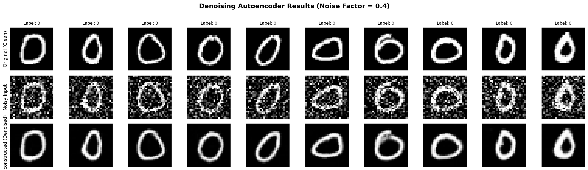
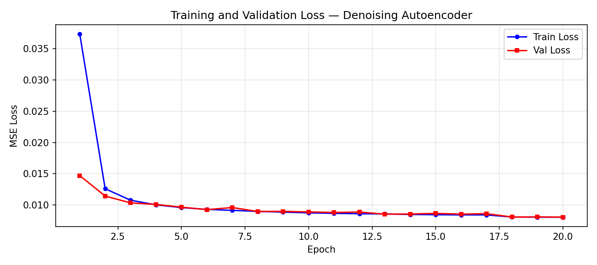
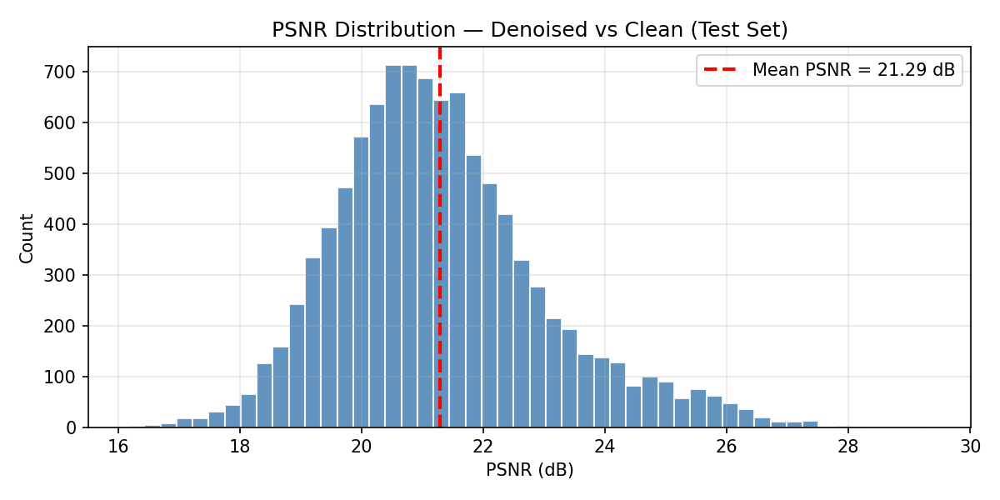
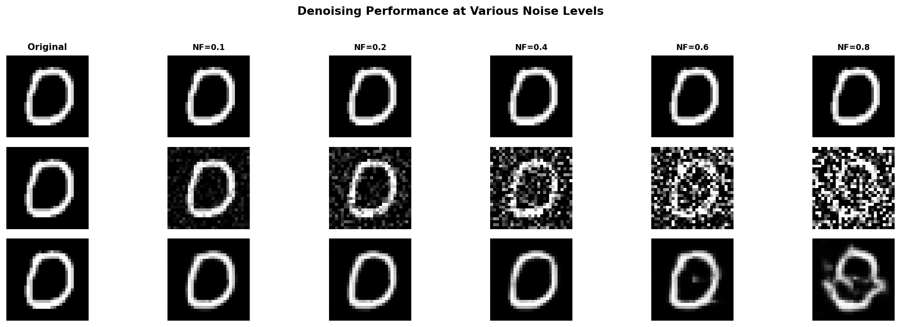

# MNIST Denoising Autoencoder

A Convolutional Denoising Autoencoder built with PyTorch that removes Gaussian noise from MNIST handwritten digit images.

---

## Project Overview

This project trains a deep learning model to **reconstruct clean images from noisy inputs**. The autoencoder learns to map corrupted (noisy) MNIST digits back to their original clean form, effectively acting as an image denoiser.

| | |
|---|---|
| **Dataset** | MNIST Handwritten Digits |
| **Framework** | PyTorch |
| **Task** | Image Denoising |
| **Noise Type** | Gaussian Noise |

---

## Pipeline

1. **Load & Preprocess** — Load MNIST PNG images, normalize to [0, 1], split into train/val/test
2. **Add Noise** — Corrupt input images with Gaussian noise (factor = 0.4)
3. **Train Autoencoder** — Feed noisy images as input, clean images as targets
4. **Evaluate** — Generate denoised outputs on test set, measure MSE and PSNR

---

## Model Architecture

```
Encoder
  Conv2d(1→32)  + BatchNorm + ReLU + MaxPool   →  32×14×14
  Conv2d(32→64) + BatchNorm + ReLU + MaxPool   →  64×7×7
  Conv2d(64→128)+ BatchNorm + ReLU + MaxPool   →  128×4×4

Decoder
  ConvTranspose2d(128→64) + BatchNorm + ReLU   →  64×8×8
  ConvTranspose2d(64→32)  + BatchNorm + ReLU   →  32×16×16
  ConvTranspose2d(32→1)   + Sigmoid            →  1×28×28
```

---

## Training Setup

| Hyperparameter | Value |
|---|---|
| Loss Function | MSE Loss |
| Optimizer | Adam (lr=1e-3) |
| Scheduler | ReduceLROnPlateau |
| Epochs | 20 |
| Batch Size | 128 |
| Noise Factor | 0.4 |

---

## Results

### Original vs Noisy vs Reconstructed



### Training & Validation Loss



### PSNR Distribution on Test Set



### Effect of Different Noise Levels



---

## Key Observations

- The model successfully recovers digit structure even at moderate-to-high noise levels
- Convolutional layers outperform fully-connected layers for spatial denoising tasks
- BatchNorm stabilizes training and speeds up convergence
- At very high noise (factor > 0.7), some edge detail is lost — expected given bottleneck compression
- ReduceLROnPlateau scheduler prevents overshooting near convergence

---

## Dataset

**MNIST Handwritten Digits Dataset**

| | |
|---|---|
| **Original Source** | [Yann LeCun's MNIST Database](http://yann.lecun.com/exdb/mnist/) |
| **Kaggle (PNG format)** | [awsaf49/mnist-dataset](https://www.kaggle.com/datasets/awsaf49/mnist-dataset) |
| **Original Authors** | Yann LeCun, Corinna Cortes, Christopher J.C. Burges |

- 60,000 training images + 10,000 test images
- 28×28 greyscale pixels, 10 digit classes (0–9)
- Images normalized to [0, 1]

> Dataset was sourced from Kaggle in PNG format and loaded using a custom PyTorch Dataset class.

---

## How to Run

### Google Colab (Recommended)
1. Open [colab.research.google.com](https://colab.research.google.com)
2. File → Upload notebook → select `MNIST_Denoising_Autoencoder.ipynb`
3. Upload `archive (2).zip` via the left sidebar file panel
4. Runtime → Change runtime type → Select **T4 GPU**
5. Runtime → **Run all**

### Local

```bash
pip install torch torchvision matplotlib pillow numpy
jupyter notebook MNIST_Denoising_Autoencoder.ipynb
```

---

## Files

| File | Description |
|---|---|
| `MNIST_Denoising_Autoencoder.ipynb` | Main notebook — full pipeline |
| `denoising_results.png` | Visual comparison: Original, Noisy, Reconstructed |
| `loss_curves.png` | Training & validation loss over epochs |
| `psnr_distribution.png` | PSNR histogram on test set |
| `noise_level_comparison.png` | Denoising at noise factors 0.1 → 0.8 |

---

## References

- LeCun, Y., Cortes, C., & Burges, C.J.C. — [The MNIST Database](http://yann.lecun.com/exdb/mnist/)
- Kaggle Dataset — [awsaf49/mnist-dataset](https://www.kaggle.com/datasets/awsaf49/mnist-dataset)
- GitHub Reference — [NvsYashwanth/MNIST-Autoecncoder](https://github.com/NvsYashwanth/MNIST-Autoecncoder)
- PyTorch Documentation — [pytorch.org](https://pytorch.org/docs/stable/index.html)
